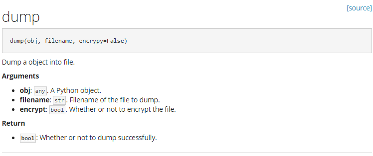

# Sophon: Automatic API Markdown Documentation Generation for Python

## What is Sophon?

Before I tell you what is Sophon, let me ask you a question: 
Are you ever tired of writing docstrings that look like this?

```
def dump(obj, filename, encrypt=False):
    """Dump a object into file.
    :param obj: A Python object
    :type obj: any
    :param filename: Filename of the file to dump
    :type filename: str
    :param encrypt: Whether or not to encrypt the file
    :type encrypt: bool
    :returns: Whether or not to dump successfully 
    :rtype: bool
    """
    pass
```


reStructuredText is great, but docstring written in reST creates visually dense, and hard to read.
Compare the jumble above to the same thing rewritten according to the [Sophon Style Python Docstring][8]:

```
def dump(obj, filename, encrypy=False):
    """Dump a object into file.
    
    # Arguments
        obj: `any`. A Python object.
        filename: `str`. Filename of the file to dump.
        encrypt: `bool`. Whether or not to encrypt the file.
        
    # Return
        `bool`: Whether or not to dump successfully.
    """
```


Use Sophon to parse the docstring and we get Markdown:

~~~
<span style="float:right;">[[source]](repo/blob/branch/__main__.py#L19)</span>

## dump

```python
dump(obj, filename, encrypy=False)
```

Dump a object into file.

**Arguments**

- **obj**: `any`. A Python object.
- **filename**: `str`. Filename of the file to dump.
- **encrypt**: `bool`. Whether or not to encrypt the file.

**Return**

- **`bool`**: Whether or not to dump successfully.

---
~~~

which is rendered by MkDocs with theme `yeti`:



Much more legible, no?

As you see, 
Sophon is a tool that could **automatically generate Markdown-format API documentations** from Python docstring,
just like **Epydoc** (supports reStructuredText, Javadoc, plaintext)
and **Napoleon** (Sphinx extension that enables Sphinx to parse both NumPy and Google 
style docstrings to reStructuredText).

Sophon is written by [Zhenpeng Deng(monitor1379)][1] and licensed under the MIT license.

## Why Sophon?

Features:
 
- **Support different kinds of docstrings.**
    Sophon mainly supports to parse docstring with the following styles and converts them to Markdown: 
    - Sophon style docstring
    - (Coming Soon) [Google style][4], the style recommended by [Khan Academy][5]
    - (Coming Soon) [NumPy style][6]
    
    Sophon also supports to parse every docstring in Python project,
    including docstrings on: `classes`, `methods` and `functions`
    (`modules`, `attributes` and `variables` will be supported soon)
    
    
- **Output Markdown format documentations.**
    Markdown is a way to write contents for the web.
    Unlike cumbersome word processing applications or other markup languages with complicated syntax,
    text written in Markdown can be easy to read, easy to write and easily shared for between computers, 
    mobile phones, and people. 
    Though it does not do anything fancy like change the font size, color or type by itself,
    it has enough stuffs to write an API documentation for your python projects.
    
    Another important reason of choosing Markdown is that there are some remarkable tools for Markdown
    to build beautiful documentations or blogs such as
    [MkDocs(Project documentation with Markdown)][2] or [Hexo(A fast, simple & powerful blog framework)][3].
   
- **Easily and Highly customizable.**
    Sophon uses [YAML: YAML Ain't Markup Language][7] as the format of configuration file.
    By configuring and providing Markdown template files, you can freely organize your documentation,
    or open some advanced features such as linking API to source files deposited on GitHub repositories.

- **One-Command build.** 
    you only need one command to build you API documentation.


You can find more details in **[User Guide/Installation](user_guide/installation.md)** or
**[User Guide/Getting Started](user_guide/getting_started.md)**.


## What does "Sophon" mean?

**Sophon** is the official translation of "**智子**" in 《Rememberance of Earth's Past II: The Dark Forest》
which is written by the famous Chinese science fiction writer named **Cixin Liu(刘慈欣)**.


**Sophon** is a word amalgamation of `Sophia/sophist/sophisticated`, meaning **wisdom**, 
and `Proton/Electron/Neutron/Photon`, meaning **particle**,
consisting of a supercomputer embedded into a single proton that could fold itself to eleven space dimensions.


[1]: https://github.com/monitor1379
[2]: http://www.mkdocs.org
[3]: https://hexo.io
[4]: http://sphinxcontrib-napoleon.readthedocs.io/en/latest/example_google.html#example-google
[5]: https://sites.google.com/a/khanacademy.org/forge/for-developers/styleguide/python#TOC-Docstrings
[6]: http://sphinxcontrib-napoleon.readthedocs.io/en/latest/example_numpy.html#example-numpy
[7]: http://www.yaml.org/
[8]: user_guide/sophon_style_python_docstrings

<!--

# Sophon: Python API文档(Markdown格式)自动生成工具

## 什么是Sophon?

Sophon是一个可以从Python docstring(文档字符串)中自动生成Markdown格式API文档的工具，
就像Epydoc(支持解析reStructuredText、Javadoc、plaintext格式的docstring)
与Napoleon(Sphinx的一个扩展工具，能够让Sphinx解析Google style和NumPy style的docstring)。

Sophon由[Zhenpeng Deng(monitor1379)][1]编写，使用MIT许可证作为软件授权条款。

## 为什么使用Sophon?

Sophon具有以下特点：

- **支持不同风格的Python docstring。**
    reStructuredText非常棒，但是用纯reST来写的Python docstring会造成视觉上的阅读障碍导致docstring难以阅读。
    所以Sophon支持以下几种风格的docstring并能够将其转换为Markdown文档：
    - Sophon风格
    - (即将支持) [Google style][4], 被[Khan Academy][5]所推荐使用的docstring风格
    - (即将支持) [NumPy style][6]
    
# TODO

-->